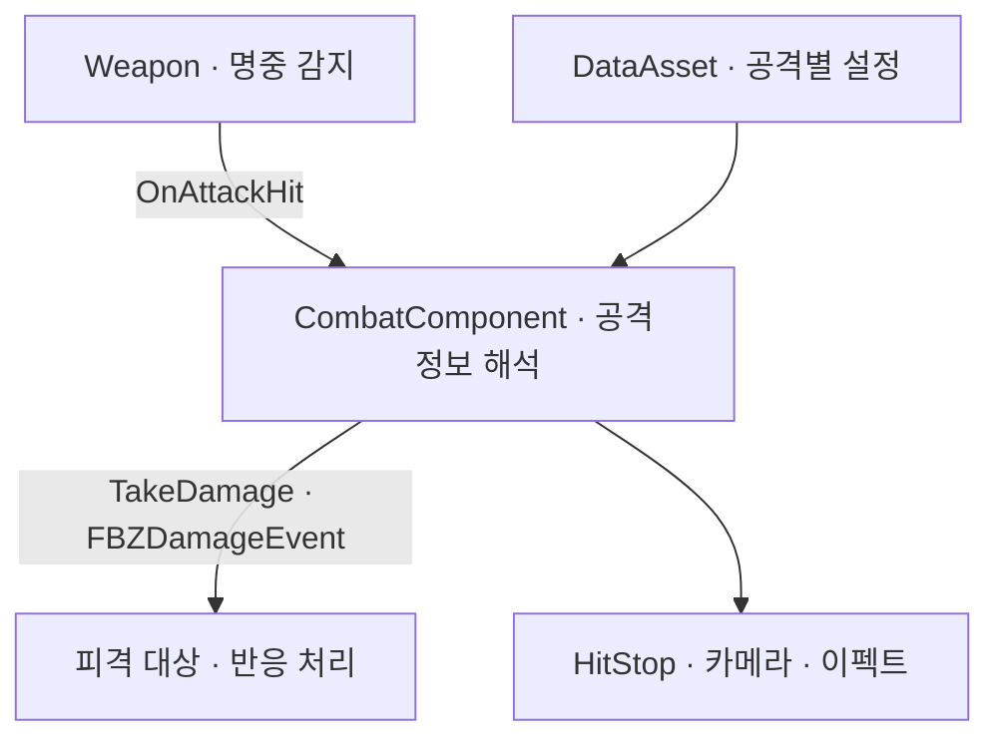

# ⚔️ BladeZ

> **UE5 C++ 기반 3D 무쌍 액션 — 플레이어 이동·카메라·전투 구현**
>
> 빠른 무기의 프레임 사이 판정 공백을 보완하고, 연타와 단일 입력을 수용하는 콤보 정책을 설계했습니다. 공격별 설정은 DataAsset으로 분리하고, 팀원과 대미지 전달·피격 반응을 연결했습니다.

<p align="left">
  
  
  
  
</p>

<p align="center">
  
  <br />
  <sub>HitStop · 카메라 셰이크 · Niagara 이펙트를 연결한 전투 피드백</sub>
</p>

## 프로젝트 개요

| 항목 | 내용 |
| --- | --- |
| 개발 기간 | 2026.05.12 ~ 2026.05.28 |
| 팀 구성 | 5인 협업 |
| 플랫폼·장르 | PC · 3D 무쌍 액션 |
| 기술 | Unreal Engine 5.6 · C++ · DataAsset · AnimNotify · Root Motion · Niagara |
| 포트폴리오 역할 | Combat Gameplay · C++ |
| 담당 | 플레이어 이동·카메라·전투, 아이템·무기 획득, 전투 연동 협의 및 팀원 디버깅 지원 |

[상세 포트폴리오 — Notion](https://app.notion.com/p/3678d1fa63aa8168b98ac79c315019c9) · [본문 코드 기준 — b7738e1](https://github.com/yj9809/BladeZ/tree/b7738e12f035c26306fbf16c580cfd450257d8e7)

## 핵심 구현

### 1. 프레임 사이 무기 판정 보완

현재 프레임의 무기 길이만 검사하면 빠르게 휘두를 때 다음 프레임의 Trace 영역과 떨어지는 구간이 생겼습니다. 무기 시작점과 끝점 사이에 **5개 지점**을 두고, 각 지점의 이전·현재 위치를 Sphere Trace로 연결했습니다.

- 현재 무기 길이 방향 1회와 이동 경로 5회를 합쳐 판정 활성 프레임마다 총 6회 검사합니다.
- 지점별 `PointHitResults`를 별도로 받은 뒤 `Append`해 앞선 검사 결과가 덮어써지지 않게 했습니다.
- 같은 Trace 활성 구간에서 이미 맞은 액터는 제외하고, 새 구간의 첫 프레임에는 이전 위치를 현재 위치로 초기화합니다.

| 보완 전 | 보완 후 |
| :---: | :---: |
|  |  |

30 FPS의 실제 플레이 조건에서 보완을 확인한 뒤, 팀원의 맵 정리·최적화 후 60 FPS와 추가 조건인 10·20·120 FPS에서도 판정 공백의 재현 여부를 확인했습니다. 반복 측정을 통한 누락 횟수·미스율 비교는 진행하지 않았습니다. 이 방식은 5개 지점의 직선 이동을 이용한 근사이며, 프레임 사이 회전 궤적 전체를 복원하지는 않습니다.

[현재 구현 — `PerformTrace`](https://github.com/yj9809/BladeZ/blob/b7738e12f035c26306fbf16c580cfd450257d8e7/Source/BladeZ/Character/Player/Weapon/BZWeaponActor.cpp#L60) · [판정 구간 제어 — AnimNotifyState](https://github.com/yj9809/BladeZ/blob/b7738e12f035c26306fbf16c580cfd450257d8e7/Source/BladeZ/Character/Player/Animation/BZANSPlayerTrace.cpp#L9) · [변경 이력](https://github.com/yj9809/BladeZ/commit/d95cd508e67486b317448e521b1211fc24cf1563)

### 2. 최신 입력 하나를 소비하는 콤보

공격 재생 속도가 빨라질수록 짧은 입력 구간에서 콤보가 끊기는 문제가 있었습니다. 입력 수락과 공격 전환 시점을 분리해 한 번 누르기와 연타를 모두 수용했습니다.

| 시점 | 처리 |
| --- | --- |
| 공격 시작 | 이전 버퍼를 비우고 공격 상태로 전환 |
| 공격 중 좌·우 입력 | `NextInputType`을 마지막 입력으로 갱신 |
| 콤보 Notify 도달 | 현재 섹션과 입력으로 다음 섹션을 결정하고 버퍼 소비 |

연타한 횟수만큼 공격을 예약하지 않고 **최신 입력 하나만 유지**합니다. 처음에는 짧은 Notify Window를 원인으로 봤지만, Blend In/Out 값에 따라 Window 시작이 실행되지 않는 현상도 확인했기 때문에 최초 가설을 확정 원인으로 단정하지 않았습니다.

[현재 구현 — `SetAttackInput` / `CheckCombo`](https://github.com/yj9809/BladeZ/blob/b7738e12f035c26306fbf16c580cfd450257d8e7/Source/BladeZ/Component/Player/BZPlayerCombatComponent.cpp#L157) · [Notify 호출 경로](https://github.com/yj9809/BladeZ/blob/b7738e12f035c26306fbf16c580cfd450257d8e7/Source/BladeZ/Character/Player/Animation/BZANComboCheck.cpp#L8) · [변경 이력](https://github.com/yj9809/BladeZ/commit/6ba69add0d513779432a9966484e6f36874e541d)

### 3. 공격 데이터와 피격 연동

공격별 콤보 전환·대미지·넉백·HitStop·이펙트·카메라 강도를 DataAsset으로 분리했습니다. 명중 감지와 공격 정보 해석은 플레이어 전투 코드가 담당하고, 대상에는 `FBZDamageEvent`로 피격 유형·넉백 여부·강도를 전달합니다.



저는 플레이어 전투와 공통 전달 형식을 구현하고 연결을 검증했습니다. 좀비의 수신·넉백 처리는 팀원이 구현했습니다.

[공격 데이터 — `FBZAttackData`](https://github.com/yj9809/BladeZ/blob/b7738e12f035c26306fbf16c580cfd450257d8e7/Source/BladeZ/Character/Player/BZPlayerAttackData.h#L10) · [대미지 전달 — `OnAttackHit`](https://github.com/yj9809/BladeZ/blob/b7738e12f035c26306fbf16c580cfd450257d8e7/Source/BladeZ/Component/Player/BZPlayerCombatComponent.cpp#L285) · [공통 전달 형식 — `FBZDamageEvent`](https://github.com/yj9809/BladeZ/blob/b7738e12f035c26306fbf16c580cfd450257d8e7/Source/BladeZ/Common/FBZDamageEvent.h#L4) · [팀원 구현 — 좀비 KnockBack](https://github.com/yj9809/BladeZ/blob/b7738e12f035c26306fbf16c580cfd450257d8e7/Source/BladeZ/Character/Enemy/Zombie/BZZombie.cpp#L541)

## 추가 구현

- **이동·카메라** — 3인칭 이동, 시점 전환, 카메라 충돌 대응
- **루트 모션 대시** — 방향별 몽타주 섹션, 적 관통·밀치기, 공중 이동량 보정과 착지 상태 복원
- **전투 피드백** — DataAsset 설정에 따른 HitStop, 카메라 셰이크, 사운드, Niagara 이펙트 연결
- **아이템·무기 획득** — 무기 교체와 획득 이벤트 연결

## 협업

Niagara 파티클을 좀비 액터로 전환하는 기능의 담당 팀원과 연동 문제를 디버깅했습니다. 파티클 ID를 C++에서 Niagara로 역전달하던 경로를 제거하고, Niagara는 거리 조건에 따른 파티클 제거를, C++는 좀비 생성을 담당하도록 역할을 나눴습니다. 수정안을 직접 테스트한 뒤 담당 팀원과 재검증해 반영했습니다.

또한 `BZSoundManager`를 구현하고 UI 담당자가 Blueprint에서 독립적으로 연결할 수 있도록 볼륨 초기화·변경·저장 시점을 문서로 전달했습니다.

[Niagara 역전달 경로 제거](https://github.com/yj9809/BladeZ/commit/505e266bb0b131993c83fe38f4b77941d3265b77) · [`BZSoundManager`](https://github.com/yj9809/BladeZ/blob/b7738e12f035c26306fbf16c580cfd450257d8e7/Source/BladeZ/Game/BZSoundManager.cpp#L13) · [Blueprint 호출 인터페이스](https://github.com/yj9809/BladeZ/blob/b7738e12f035c26306fbf16c580cfd450257d8e7/Source/BladeZ/Game/BZSoundManager.h#L32)

## 프로젝트 구조

```text
Source/BladeZ/
├─ Character/Player/
│  ├─ Animation/                 # 콤보·Trace·패링 AnimNotify
│  ├─ Weapon/BZWeaponActor       # 무기 Trace와 중복 피격 방지
│  ├─ BZPlayerCharacter          # 이동·입력·대시·피격·획득
│  └─ BZPlayerAttackData         # 공격별 DataAsset 정의
├─ Component/Player/
│  ├─ BZPlayerCombatComponent    # 콤보·대미지·전투 피드백
│  └─ BZCameraShakeComponent     # 카메라 셰이크 실행
└─ Game/BZSoundManager           # 볼륨 제어·저장과 BP 인터페이스
```

`Variant_Combat`, `Variant_Platforming`, `Variant_SideScrolling`은 Unreal Engine 템플릿 기본 제공 코드입니다.

## 빌드·실행

1. Unreal Engine 5.6과 Visual Studio의 C++ 게임 개발 도구를 설치합니다.
2. 저장소를 클론한 뒤 `BladeZ.uproject`에서 Visual Studio 프로젝트 파일을 생성합니다.
3. `Development Editor / Win64` 구성으로 빌드합니다.
4. `BladeZ.uproject`를 실행합니다.

## 저장소 정리

포트폴리오 공개본에서는 사용하지 않는 RuntimeInspector 편집기 플러그인과 테스트 위젯을 제거했습니다. 공격 데이터 배열과 주요 객체 접근에는 범위·유효성 검사를 추가했습니다.
